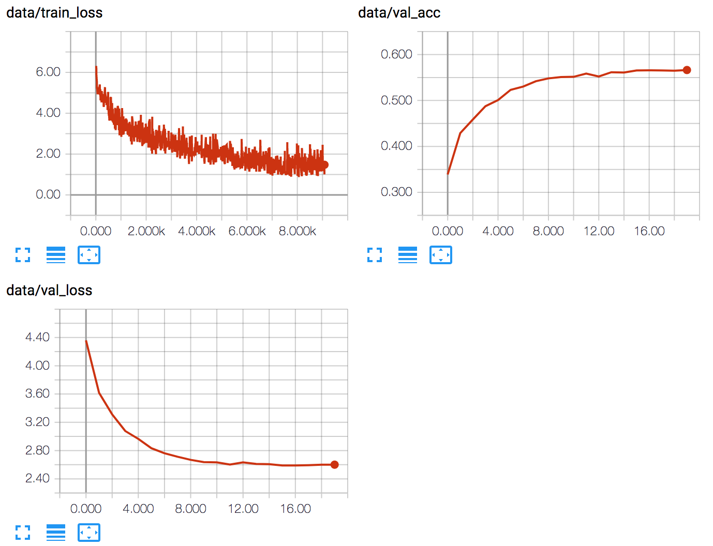

Implementation of the concepts in the referenced paper, applied to German-English translation. Model is implemented as a 2-layer bidirectional GRU encoder followed by a 4-layer GRU decoder. Uses [torchtext](https://github.com/pytorch/text) for data loading and [spacy](https://spacy.io/) for tokenization.

Translation pairs obtained from the [WMT 2016 Multi30k dataset](http://www.statmt.org/wmt16/multimodal-task.html).

Training loss, validation loss, and validation accuracy curves:  

